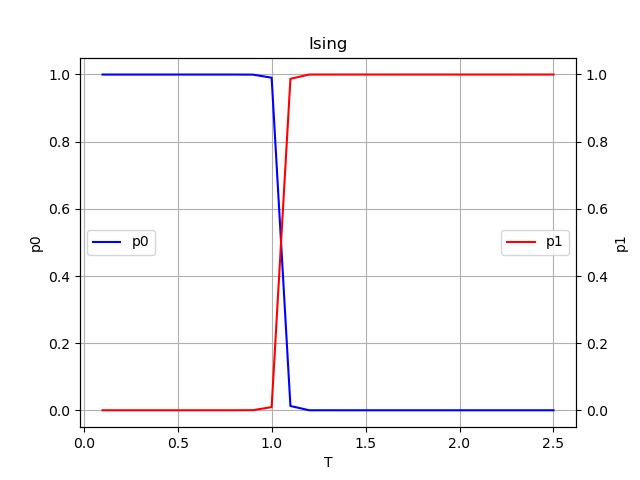

# Assignment 5

## 学生信息
- 姓名：曹以楷
- 学号：2400011486

## 运行过程

在pubpy环境下，进入assignment5目录，运行IsingModel.py脚本：
```
conda activate pubpy
cd ./assignment5
python IsingModel.py
```

## 精度问题

在.log文件中可以看到运行时的输出，我们会发现其中存在几个警告，这些警告由于影响的范围仅仅局限在几个点上，导致其对最后的结果没有影响，故我并没有修改文件，这里把问题以及可能的修复方式给出。

### 溢出
运行过程中出现过
```
.../IsingModel.py:314: RuntimeWarning: overflow encountered in exp
  return 1.0/(1.0+np.exp(-z))
```

修复方式如下：
```python
def sigmoid(x):
    if x >= 0:
        return 1.0 / (1.0 + np.exp(-x))
    else:
        return np.exp(x) / (1.0 + np.exp(x))
```

### 过小

这里同样出现了另一个精度上的问题，原来的代码中使用了`np.nan_to_num`方法就是为了规避掉这一点，然而仍然会有警告。
```
.../IsingModel.py:48: RuntimeWarning: divide by zero encountered in log
  return np.sum(np.nan_to_num(-y*np.log(a)-(1-y)*np.log(1-a)))

.../IsingModel.py:48: RuntimeWarning: invalid value encountered in multiply
  return np.sum(np.nan_to_num(-y*np.log(a)-(1-y)*np.log(1-a)))
```

修复方式如下：

```python
a = np.clip(a, eps, 1 - eps)
```

提前clip掉$0,1$这两个点即可，不过这个`eps`是一个需要调试来选择的小量。

## Ising模型



由于温度是归一化之后的$T/T_c$，所以，其在$1$附近相变，小于1为铁磁相，大于1为顺磁相。

在相变点附近，两相占比陡峭变化，且存在两相共存。

神经网络结果大体上符合物理预期，不过由于精度限制，可以看到在$0.9$处有一个转折，而在$1.0$处还有一个转折。这一点是由于温度采用$0.1$作为间隔导致的，缩小间隔来平滑这个曲线。